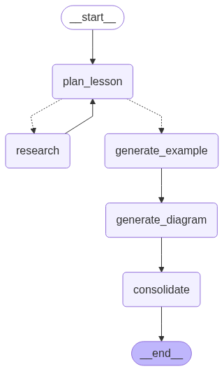

# Axiome Design Decisions
Breakdown of the various design decisions and architecture used to build Axiome. The current version is tailored towards teaching the fundamentals of graph algorithms. 

## Frontend
The frontend is built with Next.js, using TypeScript and React to design the user interface. The main page contains two primary components, the whiteboard and the text interface. The main page acts as an intermediary, facilitating the flow of Mermaid code from the text interface to the whiteboard, to be converted and rendered into Excalidraw components.

### Whiteboard
The whiteboard is where data structure visualizations like graphs can be rendered. It's built using the Excalidraw API, using a simplified version of Excalidraw. To render diagrams like graph visualizations, the mermaid-to-excalidraw library is used to convert structured Mermaid into renderable graphs on the Excalidraw whiteboard.

### Text Interface
The text interface has three tabs: the Mermaid Editor, the Adjacency List Editor, and the Chat Interface. 
- Mermaid Editor - allows for direct access to the shapes and diagrams on the Excalidraw whiteboard. The user inputs Mermaid code, and it is sent to the main page to be converted directly into Excalidraw components. This allows for more direct control over what appears on the screen, but is less useful when it comes to quickly generating graphs or other data structures.
- Adjacency List Editor - allows for quick graph visualization without the need for prior Mermaid experience. After inputting an adjacency list, the input is parsed and converted into a Mermaid diagram, which is then rendered on the Excalidraw whiteboard. Either a undirected or directed graph can be rendered. The converted Mermaid code is also displayed in the Mermaid Editor if diagram fine tuning is needed.
- Chat Interface - primary interface for interacting with the AI system in the backend. The user inputs a question or query, which makes a fetch API call to the backend, where the query is processed. The backend returns a text response to the chat interface that walks through a short lesson, and updates the Excalidraw whiteboard to help visualize the lesson.

## Backend
The backend is built with FastAPI, using Python to route user queries from the frontend. There are two primary systems managed by the FastAPI backend: a retrieval augmented generation (RAG) system built with a Qdrant vector database, and a LangGraph agent workflow for generating lessons. After receiving a query from the frontend, the top three semantically similar chunks are retrieved from Qdrant as context. Then, the query and context are routed to the LangGraph agent workflow, where a lesson is generated.

### Qdrant RAG system
Qdrant is run separately from the backend in a Docker container. Before runtime, relevant documents can be inserted into the vector database to serve as context. On startup, the FastAPI backend establishes a connection with Qdrant. Then, during runtime, queries are sent to Qdrant, and the top three most semantically similar documents are returned.

The Qdrant vector database stores documents containing grounding information about graphs and graph algorithms like depth first search. Algorithms lecture videos are transcribed, and then are split into chunks using LangChain's RecursiveCharacterTextSplitter. An embedding for each chunk is created using all-MiniLM-L6-v2 from SentenceTransformers, and then is inserted into Qdrant.  

During runtime, relevant chunks are retrieved to serve as context. After receiving a query, the Qdrant client manager in the backend sends an embedding of the query using Qdrant's FastEmbed library, which allows for fast and efficient embedding. Qdrant is queried with this embedding, and retrieves the top three closest points, which are then returned as the grounding context for the LangGraph agent workflow.

### LangGraph Agent Workflow
   
The pictured graph represents the workflow used to generate a lesson based on the user's query. Each node in the graph represents a separate agent that spawns an independent LLM with prompts specialized to a specific task.

- plan_lesson - Given the user query and relevant context, the plan_lesson agent is prompted to generate a high level lesson plan, including key definitions, learning objectives, and a plan for a short example.

- grade_plan - Given the lesson plan, the grade_plan agent returns a simple binary decision - is this lesson plan relevant and sufficient to teach the first principles of the given topic, given context from algorithms lecture? If yes, proceed to the generate_example node, otherwise, perform further research.

- research - Generates a more in-depth report on the given user query, given access to the relevant context.

- generate_example

- generate_diagram

- consolidate

