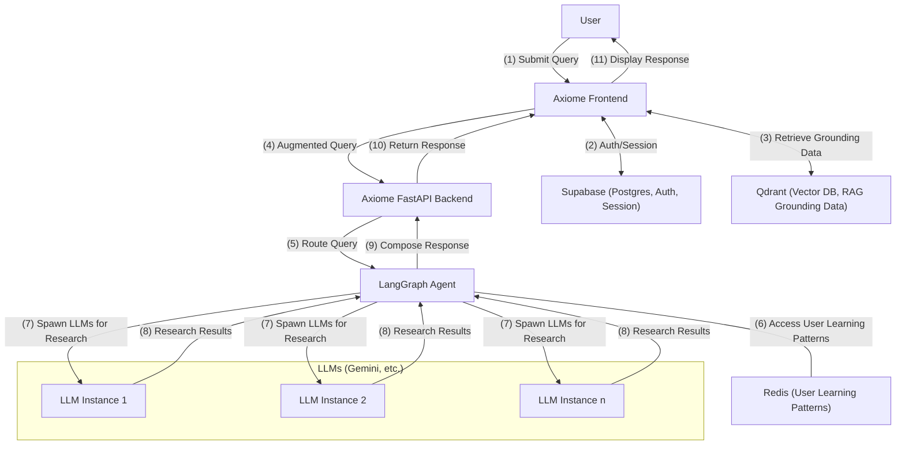
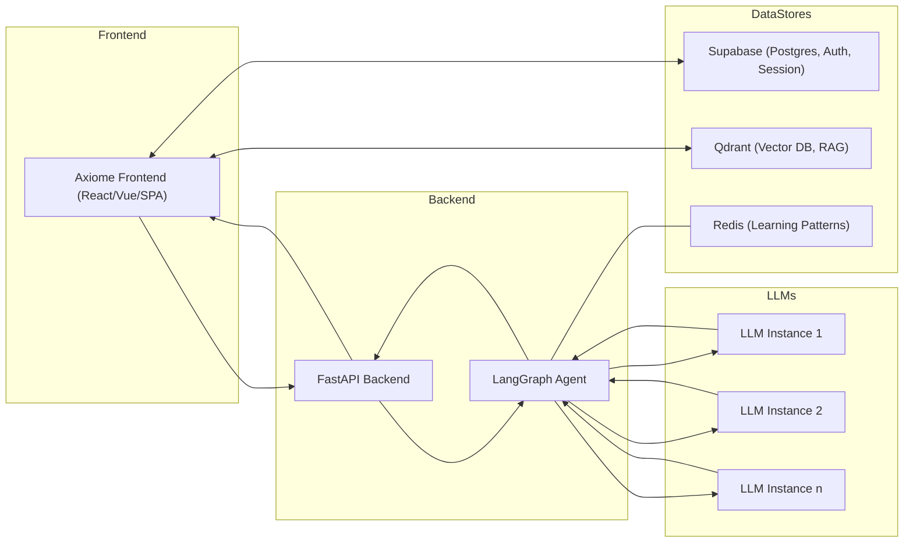
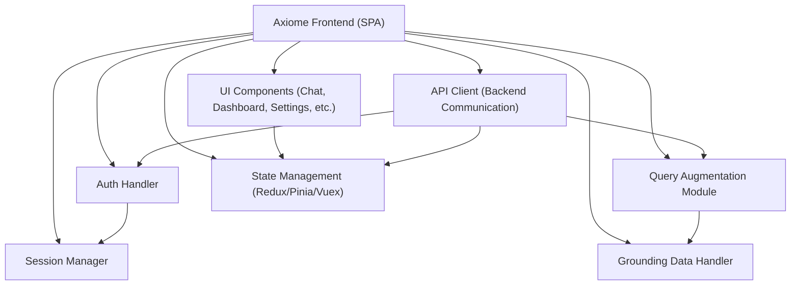
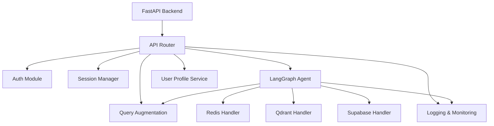
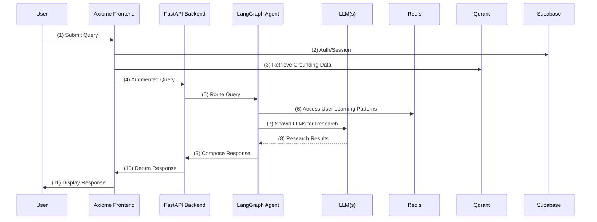

# Axiome System Architecture (v1)

This document presents the Axiome architecture using the C4 model: Context, Container, Component, and Code diagrams. Each diagram is rendered in Mermaid for clarity and professionalism.

---

## 1. System Context Diagram

---

## 2. Container Diagram

---

## 3. Component Diagrams

### 3.1 Frontend Component Diagram

### 3.2 Backend Component Diagram

---

## 4. Code/Sequence Diagram (User Query Flow)

---

**Legend:**  
- Each diagram is numbered and labeled for clarity.  
- Interactions are clearly marked and sequenced.  
- Components and data stores are visually grouped for readability.
